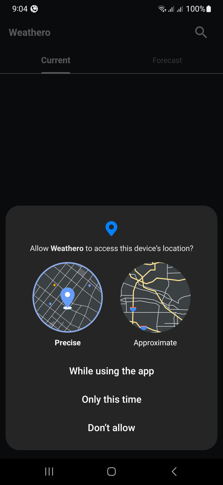
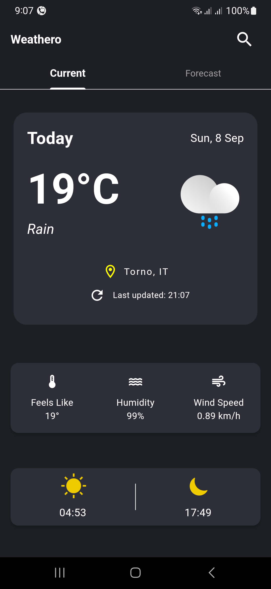
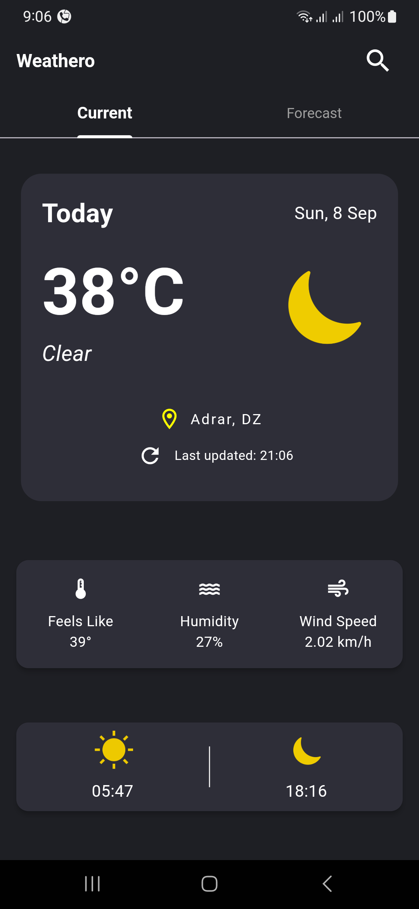
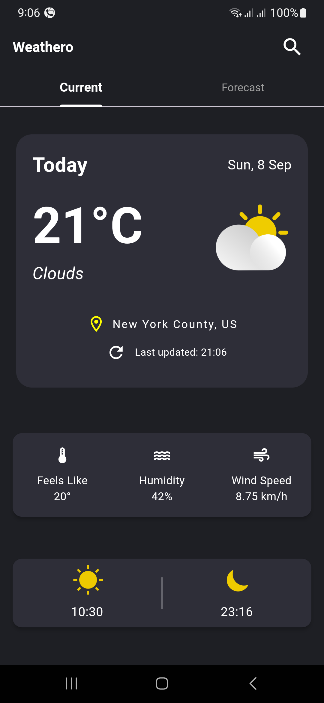
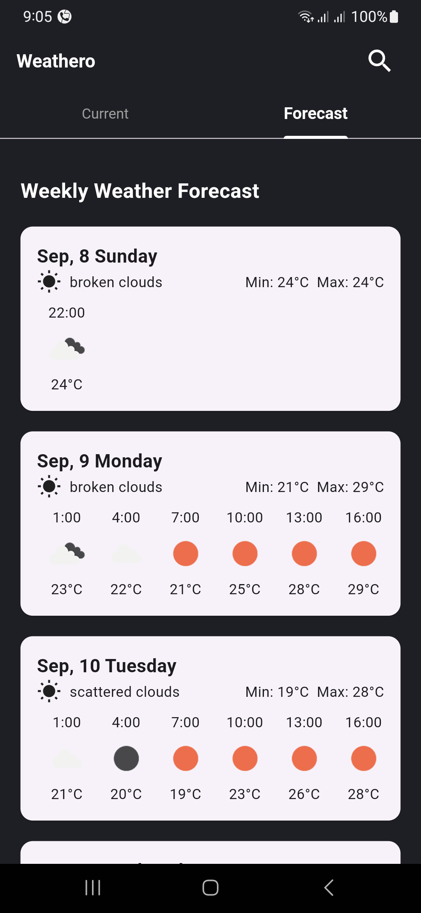
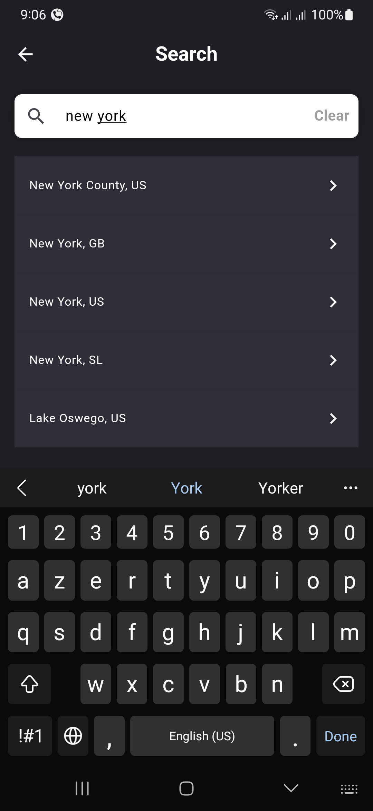
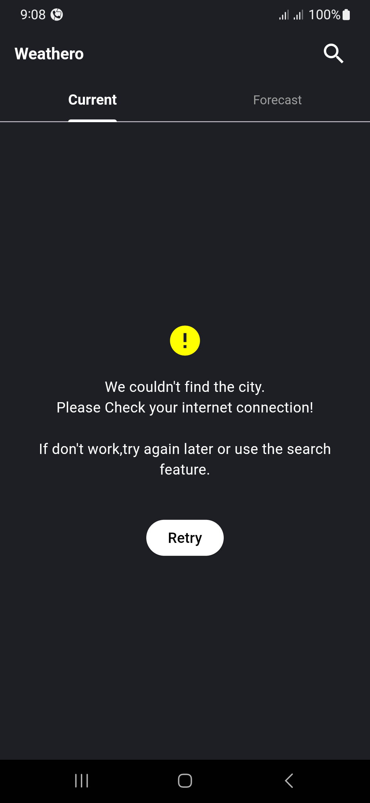

# Weather App 🌦️

Featuring a sleek and modern design, Weathero provides users with an easy-to-use interface to access real-time weather updates and detailed forecasts for the rest of the week. With a city search feature that supports Arabic and English, you can easily find comprehensive weather information for any location, ensuring you are always informed and well-prepared for changing weather conditions.

## Features ✨

- **Real-time Weather Data**: Get current weather conditions like temperature, humidity, wind speed, and more.
- **Hourly and Daily Forecasts**: View weather forecasts for the upcoming hours and days.
- **City Search**: Search for weather data by city, allowing you to check the weather in any location.
- **Interactive UI**: Modern and user-friendly interface with animated weather icons.
- **Professional Design**: Customized weather curves, sunrise/sunset times, and detailed forecast displays.

## Screenshots 📱

<p float="left">
  
  
  
  
  
  
  
  
  
  

  
</p>

## Installation and Setup 🚀

1. Clone the repository:

   ```bash
   git clone https://github.com/OTK-98/weathero.git
   ```

2. Navigate to the project directory:

   ```bash
   cd weathero
   ```

3. Install the necessary dependencies:

   ```bash
   flutter pub get
   ```

4. Obtain your API key from OpenWeatherMap and add it to your project:

   - Create a file called `.env` in the root directory.
   - Add the following line:

     ```plaintext
     API_KEY=your_api_key_here
     BASE_URL=your_api_current_weather_here
     FORECAST_URL=your_api_forecast_weather_here
     ```

5. Run the app:

   ```bash
   flutter run
   ```

## Technologies Used 🛠️

- **Flutter**: UI toolkit for building natively compiled applications.
- **GetX**: State management and dependency injection.
- **OpenWeatherMap API**: Provides weather data and forecasts.

## Project Structure 📁

```

lib/
│   ...
├── models/
│   ├── forecast_model.dart
│   └── weather_model.dart
│
├── services/
│   ├── weather_services.dart
│   └── geo_services.dart
│
└── views/
    ├── weather_screen.dart
    └── search_screen.dart
    ...

```

## Future Enhancements 🔮

- **More Detailed Forecasts**: Add more detailed forecasts like hourly wind speed, precipitation chances, etc.

## Contributing 🤝

Contributions are welcome! If you have any ideas, suggestions, or issues, feel free to submit a pull request or open an issue.

---

Developed by **Bakhti Khaled** with ❤️ using Flutter.
